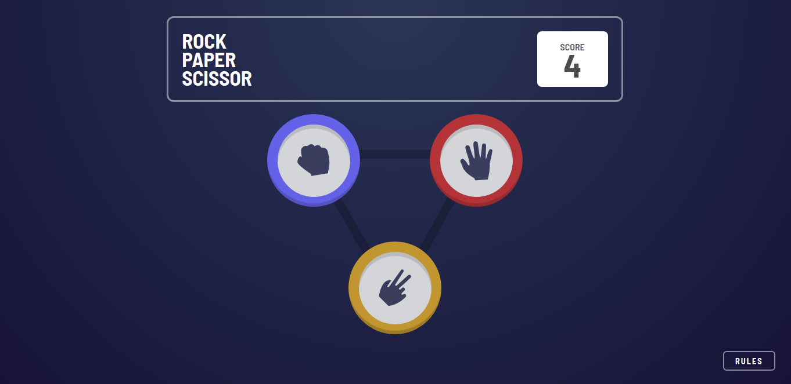
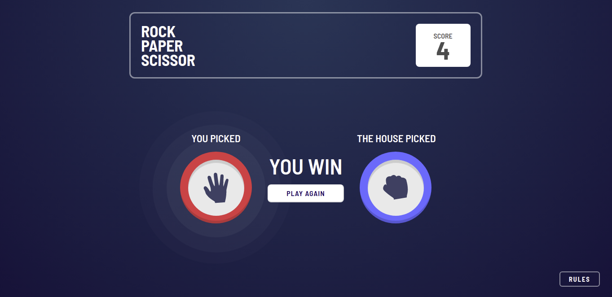
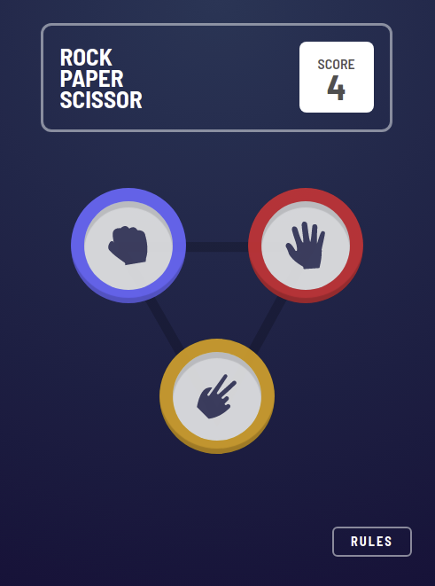
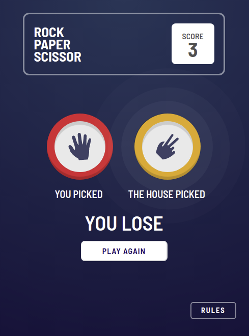

# Rock Paper Scissors
### Created by `Arthur Munhoz`
 

## Description
As a version of the famous <b>Rock Paper Scissor</b> game, this project was developed as a challenge proposed by Frontend Mentor (find out about other challenges at: [https://www.frontendmentor.io/challenges](https://www.frontendmentor.io/challenges)) .
The reason I've chosen this challenge in specific, was to be able to learn and practice some new stuff such as <b>StyledComponents</b> and <b>Animations with GSAP</b> ([https://greensock.com/react/](https://greensock.com/react/)).
  

## Check It Out!
[https://arm-rock-paper-scissor.netlify.app/](https://arm-rock-paper-scissor.netlify.app/)  

## Technology stack
- ReactJs
- Typescript
- React Hooks
- GSAP
- Bootstrap
- CSS3
- StyledComponents
- HTML

## Take a peek at the final result

 

 

## To run the project

- Make sure you have <b>Node</b> installed in your computer;
- Clone the project to wherever you want;
- Open the terminal and in the project's folder (chosen by you in the previous step), run: 
    - <i>`npm install`</i> to install all the project dependencies;
    - <i>`npm run start`</i> to build and start a local server running the application;
    - have fun =)
